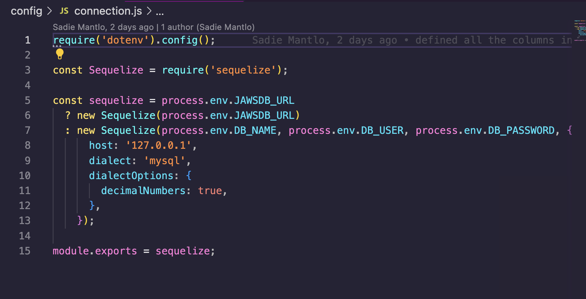
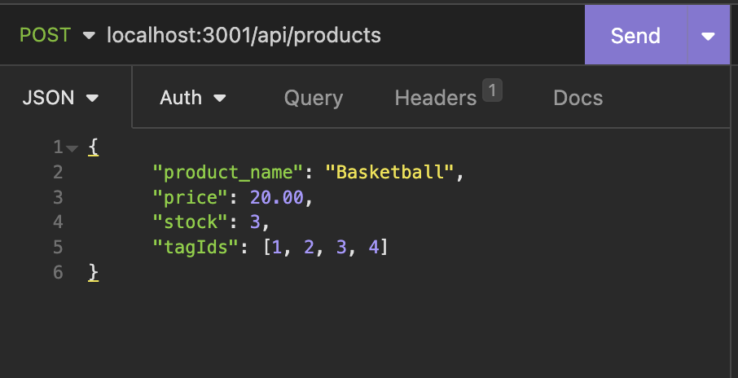

# E-Commerce Back End

## **Description**

This application is the back end for an e-commerce website. It uses an Express.js API and sequalize which allows users to connect to the database.
## **Installation**

MySQL2, Sequalize, Express JS and dotenv. 

## **Usage**

Becuase this is only a back end application, Insomnia must be used to see the functionality of the code. Users can use a GET request to retrieve all the data for categories, products, and tags. You can also use POST, PUT, and DELETE routes to successfully create, update, and delete data in the database.

### Make sure to change the MySQL connection information to your own

### Exapmle of how to format a post request in Insomnia to create a new product 

>### To watch a demo video click [here](https://drive.google.com/file/d/17aCvt08j7J1d_GQNWcVqyStSVg2rkJpg/view)